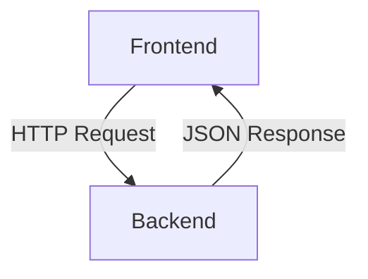

# Melchior: Predictive Analytics Assistant

<div align="center">
  
</div>

<p align="center">
  <strong>JackBot é um assistente analítico para apostas esportivas.</strong>
  <br />
  Seu objetivo é traduzir previsões estatísticas complexas em textos simples, educativos e legíveis por humanos, ajudando os usuários a tomar decisões mais informadas.
</p>

<p align="center">
  <a href="#-sobre-o-projeto">Sobre o Projeto</a> •
  <a href="#-tecnologias">Tecnologias</a> •
  <a href="#-arquitetura">Arquitetura</a> •
  <a href="#-começando">Começando</a> •
  <a href="#-endpoints-da-api">Endpoints da API</a> •
  <a href="#-roadmap">Roadmap</a>
</p>

<p align="center">
  
  
  
  
  
  
  
</p>

---

## 📖 Sobre o Projeto

O **Melchior** é um sistema de análise preditiva para o mercado de apostas esportivas. A plataforma é composta por um backend robusto em Java com Spring Boot e um frontend moderno em React com TypeScript. O objetivo principal é consumir dados estatísticos e de modelos de Machine Learning, e apresentá-los de forma clara e intuitiva para o usuário final.

### Funcionalidades

- **Backend**: Serviço RESTful que fornece predições para diversos aspectos de uma partida de futebol.
- **Frontend**: Interface reativa e amigável que consome os dados do backend e os exibe em formato de cards de predição.
- **Containerização**: Suporte a Docker para fácil configuração e deploy do ambiente de desenvolvimento.
- **Documentação de API**: Documentação automática da API com OpenAPI (Swagger).

---

## 🛠️ Tecnologias

O projeto é construído com as seguintes tecnologias:

### Backend
- **Java 21**: Versão mais recente do Java, garantindo performance e acesso a features modernas da linguagem.
- **Spring Boot 3.3.1**: Framework para criação de aplicações Java de forma rápida e configurável.
- **Spring Security**: Para futuras implementações de segurança na API.
- **Project Lombok**: Para reduzir código boilerplate em classes Java.
- **SpringDoc OpenAPI**: Para geração automática de documentação da API.
- **Maven**: Gerenciador de dependências e build do projeto.

### Frontend
- **React 19**: Biblioteca para construção de interfaces de usuário.
- **TypeScript 5**: Superset do JavaScript que adiciona tipagem estática.
- **Vite**: Ferramenta de build e desenvolvimento frontend extremamente rápida.
- **Axios**: Cliente HTTP para realizar requisições à API.
- **ESLint**: Para garantir a qualidade e padronização do código.

### Infraestrutura
- **Docker & Docker Compose**: Para containerização da aplicação e orquestração dos serviços.
- **Makefile**: Para automação de tarefas comuns de desenvolvimento.

---

## 🏗️ Arquitetura

O sistema é desenhado como uma aplicação web desacoplada, composta por dois serviços principais:

1.  **Backend (`predictive-service`):** Um microsserviço Java/Spring Boot que expõe uma API REST para buscar predições esportivas. Na sprint atual, ele serve dados realistas, porém "stubados" (hardcoded).
2.  **Frontend:** Uma aplicação de página única (SPA) em React + TypeScript que consome a API do backend e apresenta os dados ao usuário. Contém uma camada de dados robusta com hooks customizados para gerenciamento de estado, tratamento de erros e analytics.



<div align="center">
  <p>Frontend (React + Vite) rodando em <code>localhost:5173</code></p>
  <p>Backend (Java + Spring Boot) rodando em <code>localhost:8080</code></p>
</div>

---

## 🚀 Começando

Siga estas instruções para rodar o ambiente de desenvolvimento completo na sua máquina local.

### Pré-requisitos

- **Git**
- **Java 21+**
- **Docker & Docker Compose**
- **Node.js 18+ & npm**

### Rodando a Aplicação

O backend e o frontend são executados em sessões de terminal separadas.

#### **Terminal 1: Iniciar o Backend**

```bash
# 1. Clone o repositório
git clone https://github.com/Macedo-felipe/Melchior.git
cd Melchior

# 2. Configure e rode o serviço de backend usando Make
# Isso irá verificar os pré-requisitos, construir a imagem Docker e iniciar o container.
make setup && make run
```
> **Nota:** Se você não tiver o `make`, pode rodar `./setup.sh` no lugar.

A API do backend estará disponível em `http://localhost:8080`.

#### **Terminal 2: Iniciar o Frontend**

```bash
# 1. Navegue para o diretório do frontend
cd frontend

# 2. Instale as dependências
npm install

# 3. Inicie o servidor de desenvolvimento
npm run dev
```

A aplicação frontend estará disponível em `http://localhost:5173`.

---

## 🗺️ Endpoints da API

A API do backend fornece os seguintes endpoints para predições. Todos os endpoints requerem um parâmetro `matchId`.

| Método | Endpoint                   | Descrição                                                 |
|--------|----------------------------|-----------------------------------------------------------|
| `GET`  | `/api/v1/predictions/match-outcome` | Retorna probabilidades de vitória, empate e derrota.      |
| `GET`  | `/api/v1/predictions/team-sog`      | Estima os chutes a gol esperados por time.                |
| `GET`  | `/api/v1/predictions/total-goals`   | Estima o xG e probabilidades de over/under gols.          |
| `GET`  | `/api/v1/predictions/btts`          | Probabilidade de ambos os times marcarem (Both Teams to Score). |
| `GET`  | `/api/v1/predictions/corner-count`  | Total esperado de escanteios e over/under.                |
| `GET`  | `/api/v1/predictions/player-performance` | Score esperado e probabilidades de gol e assistência de um jogador. |

### Documentação Interativa (Swagger)

Com o backend em execução, a documentação completa da API está disponível em:
[http://localhost:8080/swagger-ui.html](http://localhost:8080/swagger-ui.html)

---

## 📍 Roadmap

A implementação atual usa dados "stubados" para o desenvolvimento rápido do frontend. A próxima grande fase envolve a integração de um modelo de Machine Learning real. O plano detalhado para isso está documentado em:
*   `docs/Proximos Passos.md`

---

## 🤝 Contribuições

Contribuições são o que tornam a comunidade de código aberto um lugar incrível para aprender, inspirar e criar. Qualquer contribuição que você fizer será **muito apreciada**.

Se você tiver uma sugestão para melhorar este projeto, por favor, faça um fork do repositório e crie um pull request. Você também pode simplesmente abrir uma issue com a tag "enhancement".

1.  Faça um Fork do projeto
2.  Crie sua Feature Branch (`git checkout -b feature/AmazingFeature`)
3.  Commit suas mudanças (`git commit -m 'Add some AmazingFeature'`)
4.  Push para a Branch (`git push origin feature/AmazingFeature`)
5.  Abra um Pull Request

---

## 📄 Licença

Distribuído sob a licença MIT. Veja `LICENSE` para mais informações.

---

<p align="center">
  Feito com ❤️ por Felipe Macedo
</p>
